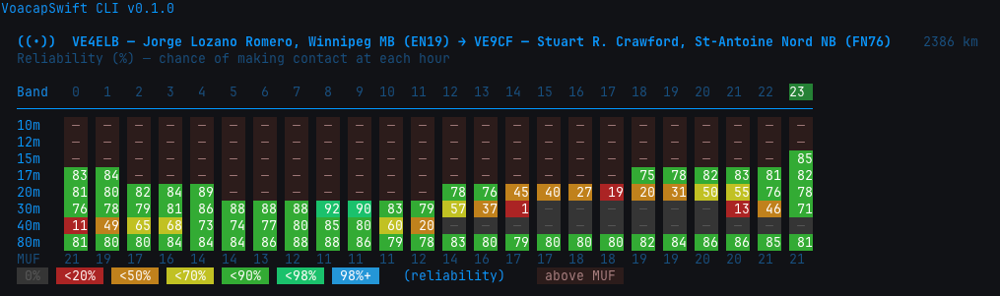

# voacap-swift


A modern Swift port of VOACAP, the Voice of America Coverage Analysis Program for HF radio propagation prediction. Originally developed by NTIA/ITS (National Telecommunications and Information Administration, Institute for Telecommunication Sciences) and adapted for POSIX systems by J.A. Watson (HZ1JW / M0DNS) as VOACAPL.

voacap-swift produces numerically identical output to the original Fortran engine across all prediction methods, with a friendly command-line interface that accepts Maidenhead grid locators, callsigns, and GPS coordinates.



## Installation

### Quick Install (macOS and Linux)

Download the latest release for your platform from [Releases](../../releases), extract it, and run the install script:

```bash
tar xzf voacap-swift-0.1.0-<platform>.tar.gz
cd voacap-swift-0.1.0-<platform>/
./install.sh
```

This installs the `voacap-swift` binary to `/usr/local/bin` and the required `itshfbc` data directory to `~/itshfbc`.

To install to a different location:

```bash
./install.sh --prefix ~/.local
```

To uninstall:

```bash
./install.sh --uninstall
```

### Build from Source

Requires Swift 5.9 or later. On macOS this comes with Xcode. On Linux, install the Swift toolchain from [swift.org](https://www.swift.org/install/).

```bash
cd VoacapSwift
make build
make install
```

Or manually:

```bash
cd VoacapSwift
swift build -c release
cp .build/release/VoacapCLI /usr/local/bin/voacap-swift
```

### Platform Support

| Platform    | Architecture | Status |
|-------------|-------------|--------|
| macOS 14+   | Apple Silicon (arm64) | Fully supported |
| macOS 14+   | Intel (x86_64) | Supported (also via Rosetta) |
| Ubuntu 22.04+ | x86_64 | Supported |
| Ubuntu 22.04+ | arm64 | Supported (Raspberry Pi, uConsole) |

## Quick Start

```bash
# Predict propagation from Winnipeg (EN19) to London (IO91)
voacap-swift --from EN19 --to IO91

# Predict a specific band with custom power
voacap-swift --from EN19 --to IO91 --band 20m --power 50

# Scan Winlink gateways from your location
voacap-swift --winlink --from EN19

# Look up a callsign
voacap-swift --lookup W1AW

# Show terminal heatmap (colored SNR grid)
voacap-swift --from EN19 --to IO91 --heatmap
```

## Usage

```
voacap-swift --from <loc> --to <loc> [options]           Predict propagation
voacap-swift --winlink --from <loc> [options]             Scan Winlink gateways
voacap-swift --lookup <callsign>                         Look up callsign info
voacap-swift [options] <itshfbc> [input] [output]        Classic VOACAP mode
```

### Location Formats

voacap-swift accepts locations in several formats:

| Format | Example | Description |
|--------|---------|-------------|
| Maidenhead grid | EN19, FN31pr | 4 or 6 character grid locator |
| Callsign | VE4ELB, W1AW | Looked up from database or online |
| Decimal degrees | 49.9,-97.1 | Latitude,longitude |
| GPS/DDM | N49:53.4 W097:09.6 | As shown on radio displays |

### Prediction Options

| Option | Default | Description |
|--------|---------|-------------|
| --from | (required) | Transmitter location |
| --to | (required) | Receiver location |
| --power | 100 | TX power in watts |
| --ssn | 100 | Sunspot number |
| --month | current | Prediction month |
| --year | current | Prediction year |
| --antenna | dipole | dipole, vertical, or isotrope |
| --band | all | 20m, 40m,20m, all, or freq in MHz |
| --heatmap | off | Show colored SNR grid in terminal |

### Winlink Gateway Scan

| Option | Default | Description |
|--------|---------|-------------|
| --winlink | | Enable gateway scan mode |
| --mode | all | Filter: vara, ardop, pactor |
| --band | all | Filter by band |
| --top | 25 | Show top N results |
| --max-dist | unlimited | Maximum distance in km |
| --all | | Include gateways with no propagation |
| --json | | Output as JSON |

### Classic VOACAP Mode

For compatibility with the original Fortran `voacapl`, voacap-swift accepts the same syntax:

```bash
voacap-swift ~/itshfbc                                      # default P2P
voacap-swift ~/itshfbc area calc default/default.voa        # area coverage
voacap-swift -s ~/itshfbc test.dat output.out               # custom I/O
```

See [VoacapSwift/README.md](VoacapSwift/README.md) for the full classic mode documentation including input file formats and prediction methods.

## Configuration

| File | Purpose |
|------|---------|
| ~/.voacaplrc | Default path to itshfbc data directory (one line) |
| ~/itshfbc/ | VOACAP coefficient, antenna, and database files |
| ~/.cache/voacapl/callsigns/ | Cached callsign lookups (JSON) |

## Performance

Benchmarked on Apple Silicon (arm64), compared with the original Fortran compiled with gfortran -O2:

| Workload | Fortran | Swift | Ratio |
|----------|---------|-------|-------|
| P2P Method 30 (24 hours) | 0.03s | 0.05s | 1.6x |
| P2P Method 25 (all modes) | 0.03s | 0.08s | 2.7x |
| Area 242x242 (58K points) | 3.5s | 10.1s | 2.9x |

The Swift port trades some speed for memory safety and a modern codebase. For interactive use and single-circuit predictions, both complete in under 100ms.

## About the Original VOACAPL (Fortran)

This repository also contains the original VOACAPL Fortran source code by J.A. Watson. To build the Fortran version, see the [original instructions](#building-the-fortran-version) below.

## Acknowledgments

This project stands on the shoulders of decades of ionospheric research and engineering.

NTIA/ITS (Institute for Telecommunication Sciences) developed the original VOACAP program as part of the Voice of America's effort to optimize HF broadcasting coverage worldwide. The propagation models, ionospheric coefficient databases, and prediction algorithms represent years of scientific work by George Lane, Fred Rhoads, Larry Teters, and many others at ITS. The software and its data files are not subject to copyright protection in the United States, as they were produced by the U.S. Government.

J.A. Watson (HZ1JW / M0DNS) created VOACAPL, the Linux/GFortran port that made VOACAP accessible beyond its original Windows-only platform. His work adapted the Fortran codebase to modern compilers and POSIX systems, and he maintains it as an open-source project released under CC0 Public Domain. This Swift port was developed from the VOACAPL source code and would not exist without his careful stewardship of the codebase.

The CCIR (now ITU-R) ionospheric coefficient maps used by VOACAP are based on decades of worldwide ionosonde observations contributed by stations across the globe. The URSI coefficients provide an alternative model with improved ocean coverage.

The amateur radio community has been the driving force behind tools like VOACAP finding continued use and development. From contesting to emergency communications, HF propagation prediction remains essential to the hobby.

## License

MIT License. Copyright (c) 2025-2026 Jorge Fabian Lozano, VE4ELB.

The original VOACAP software by NTIA/ITS is not subject to copyright in the United States. The VOACAPL modifications by J.A. Watson are released under CC0 1.0 Universal Public Domain Dedication. See [VoacapSwift/LICENSE](VoacapSwift/LICENSE) for full details.

## Contributing

Contributions are welcome. The codebase is pure Swift with no external dependencies. To get started:

```bash
git clone https://github.com/jflozanor/voacap-swift.git
cd voacap-swift/VoacapSwift
swift build
swift test
```

Report bugs and feature requests via [GitHub Issues](../../issues).

73 de VE4ELB

---

## Building the Fortran Version

The original VOACAPL Fortran code requires gfortran:

```bash
# Ubuntu/Debian
sudo apt-get install gfortran

# Fedora
sudo yum install gcc-gfortran
```

Build and install:

```bash
automake --add-missing
autoreconf
./configure
make
sudo make install
makeitshfbc
```

Run:

```bash
voacapl ~/itshfbc
```

See the [VOACAPL wiki](https://github.com/jawatson/voacapl/wiki) for further guidance.

73's Jim (M0DNS / HZ1JW)
